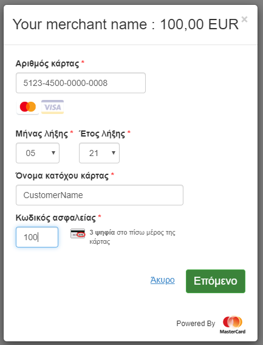
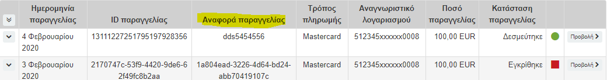

# Welcome to the Enterprise E-commerce solution
##  Empower and update your website with payment capabilities offered and supported entirely by NBG.

### UPDATE: [Transition to the new EMV 3DS authentication](#Transition-to-the-new-EMV-3DS-authentication)
</br>

### How to integrate & test:

[Hosted checkout](#Hosted-checkout)

[Hosted session](#Hosted-session)

[Direct API](#Direct-API)

### Important Resources:
[Credentials](https://files.nbg.gr/ecommerce/docs/i-Bank%20e-Enterprise%20API%20Credentials.docx)

[Developer Guide](https://files.nbg.gr/ecommerce/docs/Integration%20Guide%20i-Bank%20e-Enterprise.pdf)

## [Save your test results](#Test-results)

# Hosted checkout:

 Sample page:
```
<html>
    <head>
        <script src="https://ibanke-commerce.nbg.gr/checkout/version/57/checkout.js"
                data-error="errorCallback"
                data-cancel="cancelCallback">
        </script>

        <script type="text/javascript">
            function errorCallback(error) {
                  console.log(JSON.stringify(error));
            }
            function cancelCallback() {
                  console.log('Payment cancelled');
            }

            Checkout.configure({
                version: '57',
		lineOfBusiness: 'ENFORCE',
                merchant: 'Your merchant ID',
                order: {
                    amount: function() {
                        //You can dynamically calculate the amount
                        return 80 + 20;
                    },
                    currency: 'EUR',
                    description: 'Ordered goods',
                    id: 'Unique order ID',
                    reference: 'Unique reference number'
                },
                interaction: {
                    operation: 'PURCHASE', // set this field to 'PURCHASE' for Hosted Checkout to perform a Pay Operation.
                    merchant: {
                        name: 'Your merchant name',
                        address: {
                            line1: '200 Sample St',
                            line2: '1234 Example Town'
                        }
                    }
                }
            });
        </script>
    </head>
    <body>
        ...
        <input type="button" value="Pay with Lightbox" onclick="Checkout.showLightbox();" />
        <input type="button" value="Pay with Payment Page" onclick="Checkout.showPaymentPage();" />
        ...
    </body>
</html>
```
**Configure Object Properties**
 - version: '57' is the current API version. Do not change unless notified.
 - lineOfBusiness: In this field you specify how the transaction is going to be processed. The allowable values are "ENFORCE" and "DONOTENFORCE". For transactions that require the CVV code of the card the value must be "ENFORCE". For transactions that don't require the CVV code such as payment with a card token the value must be "DONOTENFORCE". **Note** that if you use a session Id it's recommended that you pass the lineOfBusiness field only in the create checkout session request (see below).
- merchant: The MID row from the [credentials file](https://files.nbg.gr/ecommerce/docs/i-Bank%20e-Enterprise%20API%20Credentials.docx). In TEST mode, all MIDs are prefixed with TEST, eg TEST799700711
- order
	- amount: Transaction amount, can be dynamically calculated
	- currency: Always set to 'EUR'
	- description: Any string
	- id: Unique ID number, generated by Simplify if not provided
	- reference: Unique Merchant Reference Number used to identify transaction in the merchant portal
- interaction
	- operation: Purchase or Authorize, depending on the merchant's configuration. Please check the credentials you are using for 1-Step or 2-Step payment flow (Authorize->Capture or Pay). A merchant cannot support both flows.
	- merchant
		- name: Merchant's name, any string
		- address: Merchant's address

**Notes**
- In the checkout.configure function you provide a json object with the details of the transaction, as shown in the sample page above.
- Inside the order element you can specify the amount (which can be dynamically calculated), the unique id number which you should provide but will be automatically generated if not and the reference number which you must provide to be able to match the transaction in your administrator page. The reference number can be for example a shopping cart number, an order number, or an invoice number.
- Inside the interaction element the operation attribute can be set to PURCHASE for a payment operation or to AUTHORIZE if you want to capture the amount authorized later.
- You can use hosted checkout in two ways, Lightbox or Payment page:

- With Lightbox a popup window appears and the transaction is completed without redirecting the customer to another page
- With Payment page the customer is redirected to the checkout page
- Inside the body of the script tag that references  **checkout.js** you can define any callback functions you want to use. Callbacks are optional, but all defined callbacks _must_ have an implementation. They will be invoked when the relevant event is triggered. Below you can see an example on how to redirect the customer back to your site after a transaction. First you need to request a checkout session using the Create Checkout Session operation ([see documentation](https://ibanke-commerce.nbg.gr/api/documentation/apiDocumentation/rest-json/version/latest/operation/Session%3a%20Create%20Checkout%20Session.html?locale=en_US)). The request should include payment and interaction data, as well as completion instructions. Include the returned session.id in the Checkout.configure( ) request to the Mastercard Payment Gateway.

**Create Checkout Session call request:**
```
{
    "apiOperation": "CREATE_CHECKOUT_SESSION",
    "lineOfBusiness": "ENFORCE",
    "order": {
        "currency": "EUR",
        "id": "Unique order ID"
    },
    "interaction": {
        "operation": "PURCHASE", // set this field to 'PURCHASE' for Hosted Checkout to perform a Pay Operation.
        "returnUrl": "your website"
    }
}
```
**Addition of the session.Id obtained:**
```
Checkout.configure({
                version: '57',
                merchant: 'Your merchant ID',
                order: {
                    amount: function() {
                        //You can dynamically calculate the amount
                        return 80 + 20;
                    },
                    currency: 'EUR',
                    description: 'Ordered goods',
                    id: 'Unique order ID',
		    reference: 'Unique reference number'
                },
                interaction: {
                    operation: 'PURCHASE', 
                    merchant: {
                        name: 'Your merchant name'
                    }
                },
		session: {
			id: 'SessionId'
		}
            });
```
In the example above we pass the redirectUrl in the create session request. You also have the option to pass it in a Complete Callback call. For more information on Callbacks, how to handle responses and redirect to your site [see here](https://ibanke-commerce.nbg.gr/api/documentation/integrationGuidelines/hostedCheckout/integrationModelHostedCheckout.html#x_HCOCallbacks).

### Installments via the hosted checkout
In order to support payments with installments you need to follow the two step payment method (AUTHORIZE-CAPTURE):
1. Create a checkout session and provide the order.certainty field with the value 'ESTIMATED'
2. The operation of the checkout must be 'AUTHORIZE' and not 'PURCHASE'

**Create Checkout Session call request for installments support:**
```
{
    "apiOperation": "CREATE_CHECKOUT_SESSION",
    "lineOfBusiness": "ENFORCE",
    "order": {
        "currency": "EUR",
        "id": "Unique order ID",
	"certainty": "ESTIMATED"
    },
    "interaction": {
        "operation": "AUTHORIZE",
        "returnUrl": "your website"
    }
}
```
3. Add the obtained sessionId in the checkout.Configure() method
4. After the transaction is completed you need to execute a direct API call to capture the authorized amount. An example for the capture call is shown below:

Url: ``https://ibanke-commerce.nbg.gr/api/rest/version/57/merchant/<your merchantId>/order/<OrderId of the order to be captured>/transaction/<a new transactionId>``

PUT request:
```
{
    "apiOperation": "CAPTURE",
    "transaction": {
    	"amount": <the amount that was previously authorized>,
        "currency": "EUR"
    }
}
```

### Tokenization via the hosted checkout
You can tokenize a card by following these steps:
1. Create a checkout session as above
2. Add the obtained sessionId in the checkout.Configure() method
3. After the transaction is completed you need to execute a direct API call to tokenize the card, using the sessionId. An example for the call is shown below:

Url: ``https://ibanke-commerce.nbg.gr/api/rest/version/57/merchant/<your merchantId>/token``

PUT request:
```
{
    "session": {
        "id": "sessionId"
    }
}
```
For more information on tokenization [see here](https://eu-gateway.mastercard.com/api/documentation/apiDocumentation/rest-json/version/latest/operation/Tokenization%3a%20%20Create%20or%20Update%20Token.html?locale=en_US)

[**Documentation for hosted checkout**](https://ibanke-commerce.nbg.gr/api/documentation/integrationGuidelines/hostedCheckout/integrationModelHostedCheckout.html)


After the setup you will need to complete some test transactions to make sure that you are setup correctly and ready to go live

**Make sure to save the order.reference for every test transaction**

The card used in the tests is a test card enrolled with 3DS authentication.

 [**For more test cards click here**](https://ibanke-commerce.nbg.gr/api/documentation/integrationGuidelines/supportedFeatures/testAndGoLive.html?locale=en_US)

**Card info:**

Number: 5123 4500 0000 0008

Exp. Date: 05/21 (this date is used for the test card to be approved)

CVC: 100 (valid CVC number for the test card)

### **Scenario 1:** _Successful transaction with 3DS authentication successful_

Enter the card details and all other required details for the transaction



In the following 3DS emulator choose &quot;Authentication successful&quot; and press &quot;Submit&quot;

The payment should be completed successfully

### **Scenario 2:** _Transaction with 3DS authentication failure_

Enter all required details as before

In the following 3DS emulator choose &quot;Authentication failed&quot; and press &quot;Submit&quot;

The payment should be declined


### **Scenario 3:** _Successful transaction with 3DS authentication attempted_

Enter all required details as before

In the following 3DS emulator choose &quot;Authentication Attempted&quot; and press &quot;Submit&quot;

The payment should be completed successfully

### **Scenario 4:** _Successful transaction with 3DS authentication unavailable_

Enter all required details as before

In the following 3DS emulator choose &quot;Authentication Not Available&quot; and press &quot;Submit&quot;

The payment should be successful

For each of the above transactions you can confirm the result from the merchant administrator page  (see screenshot bellow) using the reference number you provided.



 # Hosted Session

Choose the Hosted Session model if you want control over the layout and styling of your payment page, while reducing PCI compliance costs. The Hosted Session JavaScript client library enables you to collect sensitive payment details from the payer in payment form fields, sourced from and controlled by MasterCard Payment Gateway. The gateway collects the payment details in a payment session and temporarily stores them for later use. You can then include a payment session in place of payment details in the transaction request to process a payment.

### Sample page to create a hosted session:
```
<html>
<head>
<!-- INCLUDE SESSION.JS JAVASCRIPT LIBRARY -->
<script src="https://ibanke-commerce.nbg.gr/form/version/57/merchant/<Your merchant ID>/session.js"></script>

<!-- APPLY CLICK-JACKING STYLING AND HIDE CONTENTS OF THE PAGE -->
<style id="antiClickjack">body{display:none !important;}</style>
</head>
<body>

<!-- CREATE THE HTML FOR THE PAYMENT PAGE -->

<div>Please enter your payment details:</div>
<h3>Credit Card</h3>
<div>Card Number: <input type="text" id="card-number" class="input-field" title="card number" aria-label="enter your card number" value="" tabindex="1" readonly></div>
<div>Expiry Month:<input type="text" id="expiry-month" class="input-field" title="expiry month" aria-label="two digit expiry month" value="" tabindex="2" readonly></div>
<div>Expiry Year:<input type="text" id="expiry-year" class="input-field" title="expiry year" aria-label="two digit expiry year" value="" tabindex="3" readonly></div>
<div>Security Code:<input type="text" id="security-code" class="input-field" title="security code" aria-label="three digit CCV security code" value="" tabindex="4" readonly></div>
<div>Cardholder Name:<input type="text" id="cardholder-name" class="input-field" title="cardholder name" aria-label="enter name on card" value="" tabindex="5" readonly></div>
<div><button id="payButton" onclick="pay('card');">Pay Now</button></div>

<h3>Gift Card</h3>
<div>Card Number: <input type="text" id="gift-card-number" class="input-field" value="" readonly></div>
<div>Pin:<input type="text" id="gift-card-pin" class="input-field" value="" readonly></div>

<div><button id="payButton" onclick="pay('giftCard');">Pay With Gift Card</button></div>

<h3>Automated Clearing House</h3>
  <div>
  <label class="control-label" id="ach-account-type-label">Account Type:</label>
  <select class="form-control col-sm-6" name="ach-account-type" id="ach-account-type">
  <option value="CONSUMER_SAVINGS">Consumer Savings Account</option>
  <option value="CONSUMER_CHECKING" selected>Consumer Checking Account</option>
  <option value="CORPORATE_CHECKING">Business Checking Account</option>
 </select>
    </div>

<div>Bank Account Holder:<input type="text" id="ach-account-holder" class="input-field" value="" readonly></div>
<div>Bank Account Number:<input type="text" id="ach-account-number" class="input-field" value="" readonly></div>
<div>Routing Number:<input type="text" id="ach-routing-number" class="input-field" value="" readonly></div>

<div><button id="payButton" onclick="pay('ach');">Pay With ACH</button></div>
<hr>


<!-- DISPLAY VISA CHECKOUT AND AMEX EXPRESS CHECKOUT AS A PAYMENT OPTION ON YOUR PAYMENT PAGE -->

<!-- REPLACE THE action URL with the payment URL on your webserver -->
<form name="myform" method="POST" action="https://my.company.com/pay">
<!-- Other fields can be added to enable you to collect additional data on the payment page -->
Email: <input type="text" name="email">
<!-- The hidden values below can be set in the callback function as they are returned when creating the session -->
<input type="hidden" name="sessionId" id="sessionId">

<div id="amex-express-checkout"></div>
</form>

<!-- JAVASCRIPT FRAME-BREAKER CODE TO PROVIDE PROTECTION AGAINST IFRAME CLICK-JACKING -->
<script type="text/javascript">
if (self === top) {
    var antiClickjack = document.getElementById("antiClickjack");
    antiClickjack.parentNode.removeChild(antiClickjack);
} else {
    top.location = self.location;
}

PaymentSession.configure({
    session: "{Previously created session ID}", //see note below
    fields: {
        // Attach hosted fields to your payment page
            card: {
                number: "#card-number",
                securityCode: "#security-code",
                expiryMonth: "#expiry-month",
                expiryYear: "#expiry-year",
                nameOnCard: "#cardholder-name"
            },
            giftCard: {
                    number: "#gift-card-number",
                    pin: "#gift-card-pin"
                  },
            ach: {
                    accountType: "#ach-account-type",
                    bankAccountHolder: "#ach-account-holder",
                    bankAccountNumber: "#ach-account-number",
                    routingNumber: "#ach-routing-number"
                  }
          },
    frameEmbeddingMitigation: ["javascript"],
    callbacks: {
        initialized: function(response) {
            // HANDLE INITIALIZATION RESPONSE
            if (response.status === "ok") {
                document.getElementById("visaCheckoutButton").style.display = 'block';
            }
        },

        formSessionUpdate: function(response) {
            // HANDLE RESPONSE FOR UPDATE SESSION
        if (response.status) {
            if ("ok" == response.status) {
                console.log("Session updated with data: " + response.session.id);

                //check if the security code was provided by the user
                if (response.sourceOfFunds.provided.card.securityCode) {
                    console.log("Security code was provided.");
                }

                //check if the user entered a MasterCard credit card
                if (response.sourceOfFunds.provided.card.scheme == 'MASTERCARD') {
                    console.log("The user entered a MasterCard credit card.")
                }
            } else if ("fields_in_error" == response.status)  {

                console.log("Session update failed with field errors.");
                if (response.errors.cardNumber) {
                    console.log("Card number invalid or missing.");
                }
                if (response.errors.expiryYear) {
                    console.log("Expiry year invalid or missing.");
                }
                if (response.errors.expiryMonth) {
                    console.log("Expiry month invalid or missing.");
                }
                if (response.errors.securityCode) {
                    console.log("Security code invalid.");
                }
                if (response.errors.number) {
                    console.log("Gift card number invalid or missing.");
                }
                if (response.errors.pin) {
                    console.log("Pin invalid or missing.");
                }
                if (response.errors.bankAccountHolder) {
                    console.log("Bank account holder invalid.");
                }
                if (response.errors.bankAccountNumber) {
                    console.log("Bank account number invalid.");
                }
                if (response.errors.routingNumber) {
                    console.log("Routing number invalid.");
                }
            } else if ("request_timeout" == response.status)  {
                console.log("Session update failed with request timeout: " + response.errors.message);
            } else if ("system_error" == response.status)  {
                console.log("Session update failed with system error: " + response.errors.message);
            }
        } else {
            console.log("Session update failed: " + response);
        }
        },
        visaCheckout: function(response) {
            // HANDLE VISA CHECKOUT RESPONSE
        },
        amexExpressCheckout: function(response) {
           // HANDLE AMEX EXPRESS CHECKOUT RESPONSE
        }
    },
    interaction: {
        displayControl: {
            formatCard: "EMBOSSED",
            invalidFieldCharacters: "REJECT"
        }
    },
    order: {
        amount: 10.00,
        currency: "AUD"
    },
    wallets: {
        visaCheckout: {
            enabled: true,
            // Add Visa Checkout API specific attributes here
            countryCode: "AU",
            displayName: "Display name",
            locale: "en_au",
            logoUrl: "http://logo.logo",
            payment: {
                cardBrands: [
                    "VISA"
                ]
            },
            review: {
                buttonAction: "Pay",
                message: "Message"
            },
            shipping: {
                acceptedRegions: [
                    "AU"
                ],
                collectShipping: true
            }
        },
        amexExpressCheckout: {
        enabled: true,
        // Add Amex Express Checkout API specific attributes here
        initTags: {
        "theme": "responsive",
        "env": "qa",
        "disable_btn": "false",
        "button_color": "light",
        "client_id": "<MSO Client Id from the Amex Express Checkout configuration page in Merchant Administration>",
        }
    }
}
});

function pay(paymentType) {
    // UPDATE THE SESSION WITH THE INPUT FROM HOSTED FIELDS
    if (paymentType === 'giftCard') {
        PaymentSession.updateSessionFromForm(paymentType, '<localCardBrand>');
    } else {
        PaymentSession.updateSessionFromForm(paymentType);
    }
}
</script>
</body>
</html>
```

The difference between hosted session and direct api calls is that by creating a hosted session the payment details are safely stored for the duration of the session and you can execute api calls by providing the session ID created, so you don&#39;t have to handle sensitive card information.

**Please note that depending on the type of transasaction about to be processed you need to provide the lineOfBusiness field by creating a session prior to the hosted session form load and adding the sessionId to the form.**

In the lineOfBusiness field you specify how the transaction is going to be processed. The allowable values are "ENFORCE" and "DONOTENFORCE". For transactions with a card present that require the CVV code of the card the value must be "ENFORCE". For transactions that don't require the CVV code such as payment with a card token the value must be "DONOTENFORCE". This field should be passed in the Create Session call. Example request and documentation:

Post request
```
{
	"lineOfBusiness": "ENFORCE"
}
```
[Documentation for Create Session call](https://ibanke-commerce.nbg.gr/api/documentation/apiDocumentation/rest-json/version/latest/operation/Session%3a%20Create%20Session.html?locale=en_US)

[Documentation for Hosted Session integration](https://ibanke-commerce.nbg.gr/api/documentation/integrationGuidelines/hostedSession/integrationModelHostedSession.html)


[Documentation for the calls to the Payment Gateway](https://ibanke-commerce.nbg.gr/api/documentation/apiDocumentation/rest-json/version/latest/api.html?locale=en_US)

After the setup you will need to complete some test transactions to make sure that you are setup correctly and ready to go live

**Please note that for every transaction you need to provide a unique reference number in the order.reference field (see documentation), in order to be able to match your transactions in the merchant administrator page.**

The card used in the tests is a test card enrolled with 3DS authentication.

 [**For more test cards click here**](https://ibanke-commerce.nbg.gr/api/documentation/integrationGuidelines/supportedFeatures/testAndGoLive.html?locale=en_US)

**Card info:**

Number: 5123 4500 0000 0008

Exp. Date: 05/21 (this date is used for the test card to be approved)

CVC: 100 (valid cvc number for the test card)

### **Scenario 1:** _Successful transaction with 3DS authentication successful_

Create a hosted session with the above card details and provide the session ID to execute a pay call.

After rendering the ACS emulator from the response choose &quot;Authentication successful&quot; and press &quot;Submit&quot;

The payment should be completed successfully

### **Scenario 2:** _Transaction with 3DS authentication failure_

Create a hosted session with the above card details and provide the session ID to execute a pay call.

After rendering the ACS emulator from the response choose &quot;Authentication failed&quot; and press &quot;Submit&quot;

The payment should be declined

### **Scenario 3:** _Successful transaction with 3DS authentication attempted_

Create a hosted session with the above card details and provide the session ID to execute a pay call.

After rendering the ACS emulator from the response choose &quot;Authentication Attempted&quot; and press &quot;Submit&quot;

The payment should be completed successfully

### **Scenario 4:** _Successful transaction with 3DS authentication unavailable_

Create a hosted session with the above card details and provide the session ID to execute a pay call.

After rendering the ACS emulator from the response choose &quot;Authentication Not Available&quot; and press &quot;Submit&quot;

The payment should be successful

For each of the above transactions you can confirm the result from the merchant administrator page  (see screenshot bellow) using the reference number you provided.


 # Direct API

[Documentation for the calls to the Payment Gateway](https://ibanke-commerce.nbg.gr/api/documentation/apiDocumentation/rest-json/version/latest/api.html?locale=en_US)

After the setup you will need to complete some test transactions to make sure that you are setup correctly and ready to go live

**Please note that for every transaction you need to provide a unique reference number in the order.reference field (see documentation), in order to be able to match your transactions in the merchant administrator page.**

The card used in the tests is a test card enrolled with 3DS authentication.

[**For more test cards click here**](https://ibanke-commerce.nbg.gr/api/documentation/integrationGuidelines/supportedFeatures/testAndGoLive.html?locale=en_US)

**Card info:**

Number: 5123 4500 0000 0008

Exp. Date: 05/21 (this date is used for the test card to be approved)

CVC: 100 (valid cvc number for the test card)

### **Scenario 1:** _Successful transaction with 3DS authentication successful_

Execute a pay flow providing the above card details as shown in the documentation.

After rendering the 3DS html content from the Authenticate Payer call response, choose &quot;Authentication/Account Verification Successful&quot; in the ACS emulator and press &quot;Submit&quot;

The payment should be completed successfully

### **Scenario 2:** _Transaction with 3DS authentication failure_

Execute a pay call providing the above card details as shown in the documentation.

After rendering the ACS emulator choose &quot;Not Authenticated&quot; and press &quot;Submit&quot;

The payment should be declined


### **Scenario 3:** _Successful transaction with 3DS authentication cancelled_

Execute a pay call providing the above card details as shown in the documentation.

After rendering the ACS emulator choose &quot;Authentication Cancelled&quot; and press &quot;Submit&quot;

The payment should be declined

### **Scenario 4:** _Successful transaction with 3DS authentication unavailable_

Execute a pay call providing the above card details as shown in the documentation.

After rendering the ACS emulator choose &quot;Authentication Not Available&quot; and press &quot;Submit&quot;

The payment should be successful

For each of the above transactions you can confirm the result from the merchant administrator page  (see screenshot bellow) using the reference number you provided.


# Transition to the new EMV 3DS authentication
### How to migrate depending on your implementation:

**Hosted checkout:** </br>
With EMV 3DS the creation of a checkout session before the transcation is mandatory. Please refer to the [Hosted checkout](Hosted-checkout) section for information on how to create a session and provide the sessionId to the hosted checkout script. If you are already using a checkout session in your implementation no change is needed for the migration.</br>

**Hosted Session & Direct API:** </br>
Please refer to the official documentation for the new API flow for [EMV 3DS](https://ibanke-commerce.nbg.gr/api/documentation/integrationGuidelines/supportedFeatures/pickAdditionalFunctionality/authentication/3DS/3DSecureAuthentication.html?locale=en_US)</br>
# Test results

After completing the test scenarios you can fill this table with the reference numbers of the transactions so that we can crosscheck the results

| Transaction | Card Number | ACS Simulator | Expected Result | Input Data | Test Case | Data  Reference |
| --- | --- | --- | --- | --- | --- | --- |
| Auth/Pre | 5123450000000008 |  Authentication/Account Verification Successful | ACCEPTED | Correct Data | 3D-Secure Authenticated     |   |
| Auth/Pre | 5123450000000008 |  Not Authenticated                              | DECLINED | Correct Data | Not 3D-Secure Authenticated |   |
| Auth/Pre | 5123450000000008 |  Authentication Cancelled                       | DECLINED | Correct Data | 3D-Secure Cancelled         |   |
| Auth/Pre | 5123450000000008 |  Authentication not available                   | ACCEPTED | Correct Data | 3D-Secure Unavailable       |   |
